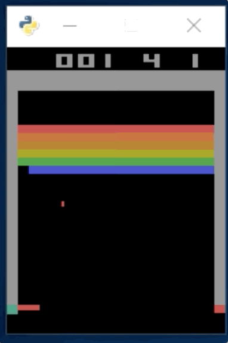

# RL Breakout-v0

Breakout-v0

Windows 10 pro에서 실험

참고.
Windows 버전과 OSX와 action_space 다름
Windows : 6개
OSX : 4개

구현방법

1. state 이미지를 gray-scale로 변환 후 0보다 큰 값들을 모두 255로 변환
2. 0과 255로 변환된 이미지를 1/2 축소(80x105) -> 이후 이미지 상단을 잘라 80x80으로 축소
3. DQN은 CNN 으로 구성
4. INPUT state 이미지로 80x80 이미지 5개 프레임으로 입력(80x80x5)
5. 학습은 매 5프레임 마다 학습
6. 리워드를 얻는 시점과 공을 친 시점이 다르기 때문에 TMPMEMORY에 저장 후 리워드 발생 시점에서 20프레임 이전 데이터에 Reward 삽입
7. TMPMEMORY는 REPLAY_MEMORY에 Total reword가 3 이상 일 때만 복사
8. 이 때 Total reword가 기존 Episode의 신기록이거나 신기록과 같으면 TMPMEMORY에 있는 데이터 전부 학습
   그 외에는 32개 batch로 Random 학습

약 500 episode 실행 중
최고기록 13
평균기록 3

